# AKS Autonomous Operations Agent — Architecture Diagrams

> All diagrams use **Mermaid** syntax and render natively in GitHub, GitLab,
> Azure DevOps Repos, and VS Code (with the Mermaid extension).

---

## Table of Contents
1. [System Context Diagram](#1-system-context-diagram)
2. [High-Level Architecture](#2-high-level-architecture)
3. [Multi-Agent Component Diagram](#3-multi-agent-component-diagram)
4. [LangGraph Workflow (State Machine)](#4-langgraph-workflow-state-machine)
5. [End-to-End Sequence Diagram](#5-end-to-end-sequence-diagram)
6. [RAG / Knowledge Flow](#6-rag--knowledge-flow)
7. [AKS Deployment Topology](#7-aks-deployment-topology)
8. [Security & Identity Flow](#8-security--identity-flow)
9. [CI/CD Pipeline Flow](#9-cicd-pipeline-flow)
10. [Terraform Infrastructure Map](#10-terraform-infrastructure-map)
11. [Observability Data Flow](#11-observability-data-flow)
12. [Incident State Lifecycle](#12-incident-state-lifecycle)
13. [Folder Structure Tree](#13-folder-structure-tree)

---

## 1. System Context Diagram

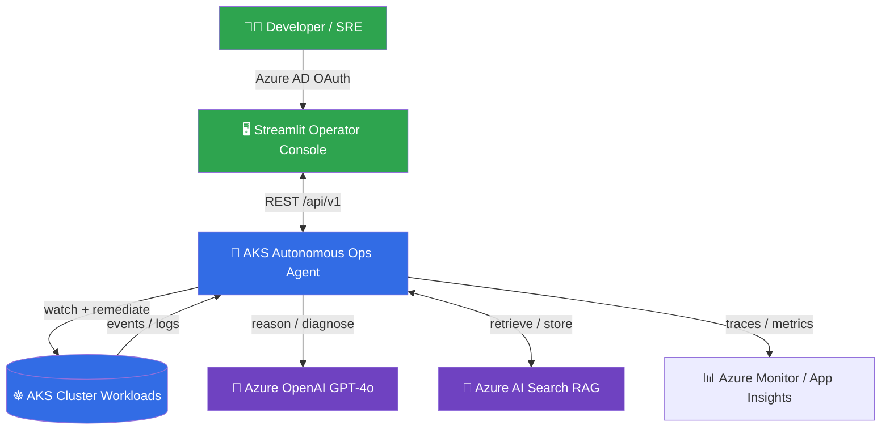

---

## 2. High-Level Architecture

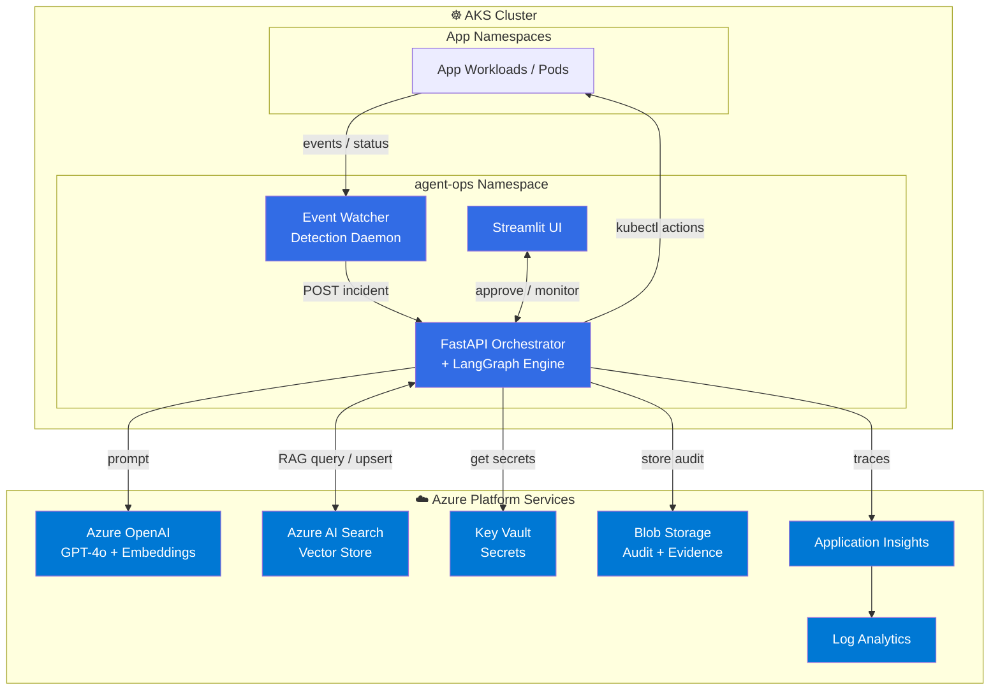

---

## 3. Multi-Agent Component Diagram

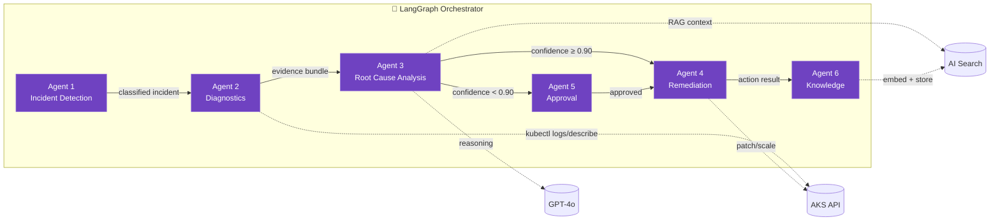

---

## 4. LangGraph Workflow (State Machine)

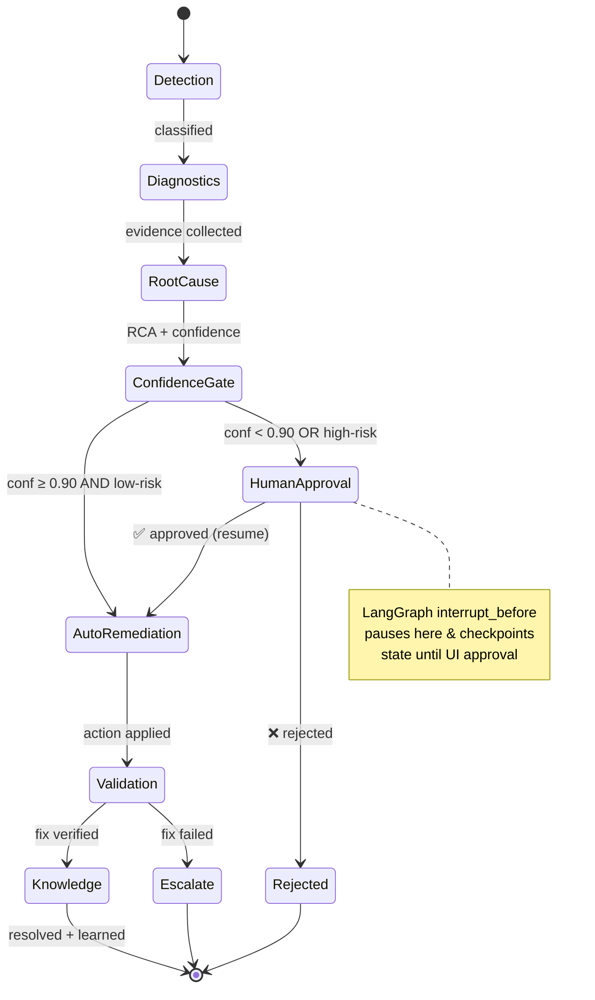

---

## 5. End-to-End Sequence Diagram

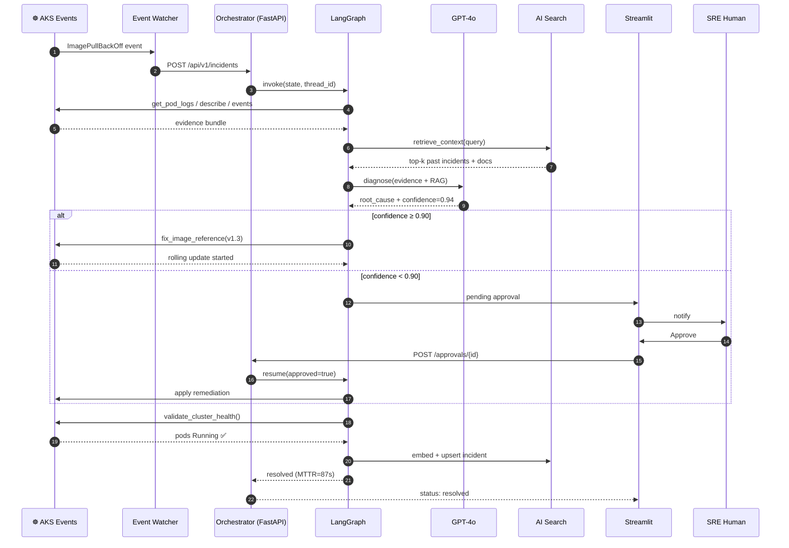

---

## 6. RAG / Knowledge Flow

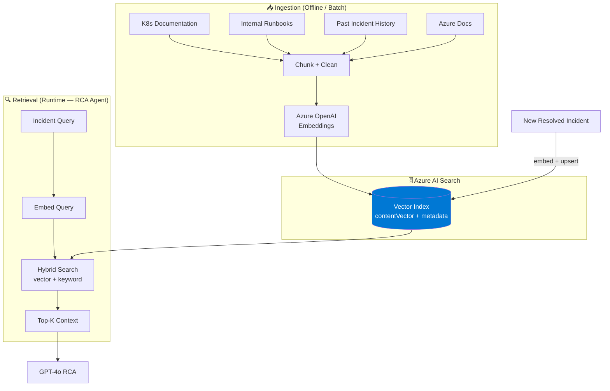

---

## 7. AKS Deployment Topology

```mermaid
graph TB
    subgraph CLUSTER["☸️ AKS Cluster (1.29)"]
        subgraph SYS["System Node Pool (autoscaled)"]
            subgraph NS["Namespace: agent-ops"]
                SA[ServiceAccount: agent-sa<br/>+ Workload Identity label]

                subgraph ORCHD["Deployment: orchestrator (2 replicas)"]
                    P1[Pod: orchestrator]
                    P2[Pod: orchestrator]
                end
                WD[Deployment: watcher (1)]
                UD[Deployment: ui (2)]

                SVC1[Service: orchestrator:8000]
                SVC2[Service: ui:8501]
                ING[Ingress<br/>TLS + Azure AD]
                HPA[HPA: CPU/Mem autoscale]
                NP[NetworkPolicy<br/>least-privilege egress]
            end
        end
    end

    ING --> SVC2 --> UD
    SVC2 -. internal .-> SVC1
    SVC1 --> ORCHD
    WD -->|POST| SVC1
    HPA -.scales.-> ORCHD
    SA -.identity.-> P1 & P2 & WD & UD

    classDef pod fill:#326ce5,color:#fff
    class P1,P2,WD,UD pod
```

---

## 8. Security & Identity Flow

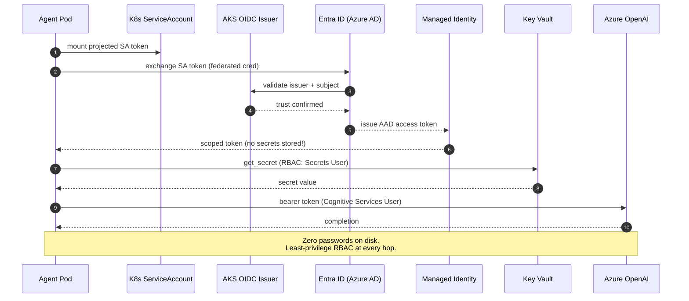

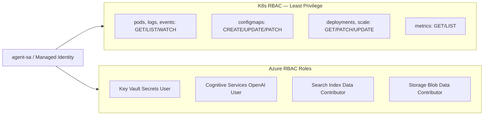

---

## 9. CI/CD Pipeline Flow

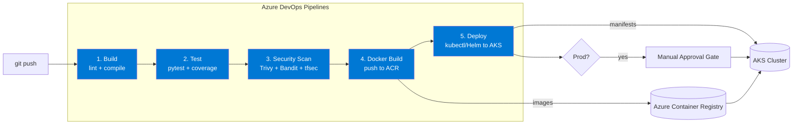

---

## 10. Terraform Infrastructure Map

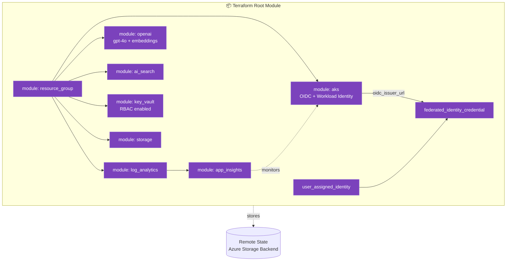

---

## 11. Observability Data Flow

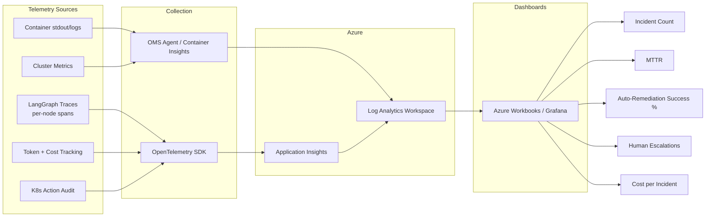

---

## 12. Incident State Lifecycle

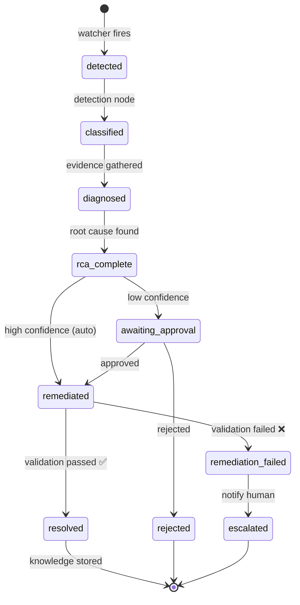

---

## 13. Folder Structure Tree

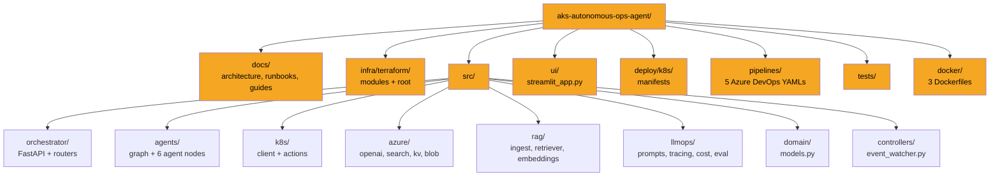

---

## Legend

| Symbol | Meaning |
|--------|---------|
| 🤖 | AI Agent / Orchestrator |
| ☸️ | Kubernetes / AKS |
| 🧠 | LLM (GPT-4o) |
| 🔎 | Vector Search (RAG) |
| ☁️ | Azure Platform Service |
| 🖥️ | User Interface |
| 📊 | Observability |

---

> **Rendering tip:** On GitHub/Azure DevOps these render automatically.
> In VS Code install **"Markdown Preview Mermaid Support"** extension.
> To export as PNG/SVG use the [Mermaid Live Editor](https://mermaid.live).