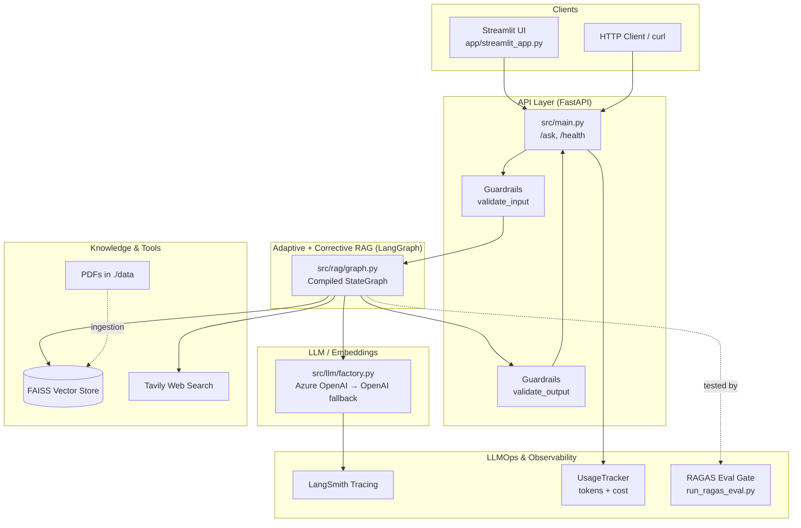
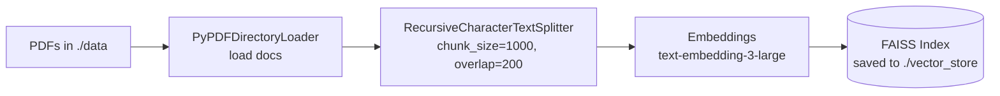
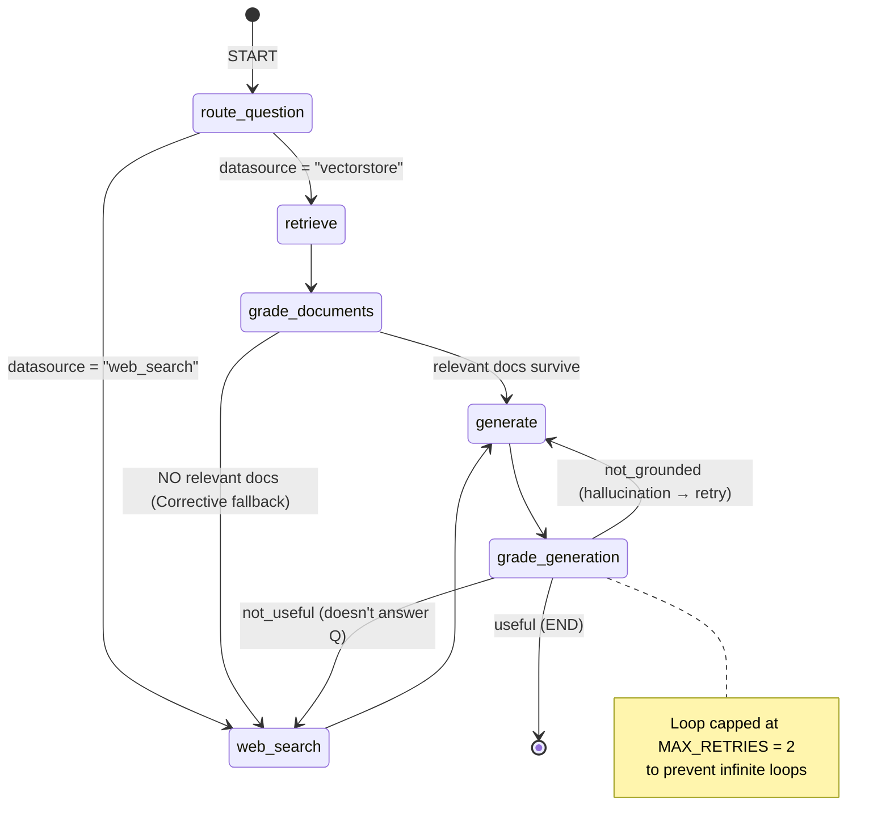
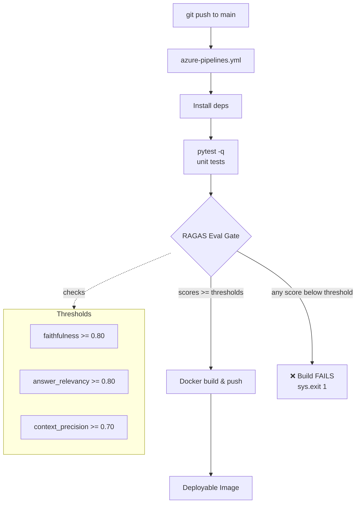
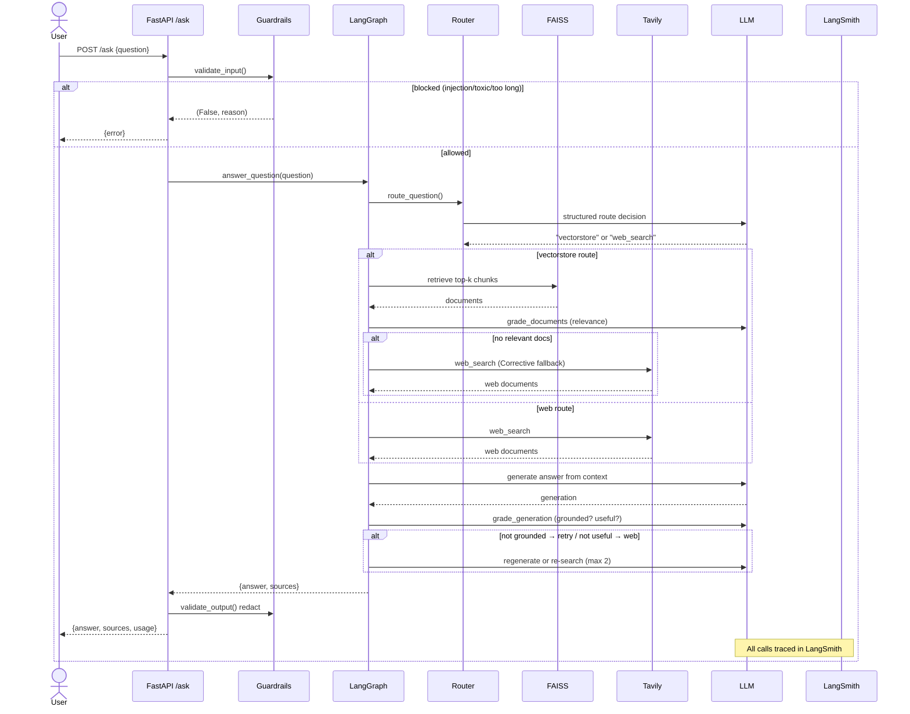

# Enterprise RAG Knowledge Assistant — Architecture & Flow (diagram.md)

This single file contains ALL diagrams and an end-to-end explanation.

---

## 1. High-Level System Architecture



---

## 2. Ingestion Pipeline (offline / one-time)



Built once via `build_vector_store()`, reloaded later via `load_vector_store()`.

---

## 3. The Core RAG Graph (LangGraph State Machine)

Combines **Adaptive RAG** (smart routing) and **Corrective RAG**
(self-correcting via grading + fallback).



### Graph State (shared memory)
```python
GraphState = {
    "question":   str,        # user's input
    "generation": str,        # current LLM answer
    "documents":  List[str],  # retrieved / filtered context
    "datasource": str,        # "vectorstore" | "web_search"
    "retries":    int,        # hallucination retry counter
}
```

---

## 4. Component Responsibilities

| Layer | File | Responsibility |
|-------|------|----------------|
| Config | `src/config.py` | Centralized env-based settings (Pydantic) |
| LLM Factory | `src/llm/factory.py` | Azure OpenAI w/ OpenAI fallback |
| Ingestion | `src/ingestion/loader.py` | PDF → chunks → FAISS index |
| Router | `src/rag/router.py` | **Adaptive**: vectorstore vs web |
| Graders | `src/rag/graders.py` | Doc relevance, hallucination, answer quality |
| Nodes | `src/rag/nodes.py` | retrieve, web_search, grade_documents, generate |
| Graph | `src/rag/graph.py` | Wires nodes + conditional edges |
| Guardrails | `src/guardrails/validators.py` | Prompt-injection, toxicity, length |
| Observability | `src/observability/tracing.py` | LangSmith + token/cost tracking |
| API | `src/main.py` | FastAPI endpoints |
| UI | `app/streamlit_app.py` | Chat interface |
| Eval | `evaluation/run_ragas_eval.py` | CI quality gate (RAGAS) |

---

## 5. CI/CD + LLMOps Quality Gate



Every prompt or model change must pass the RAGAS gate before shipping.

---

## 6. End-to-End Request Sequence



---

# How It Works — Walkthrough with an Example

### Example Query
> **User asks:** *"What is the company's remote work policy?"*

**Step 1 — API Entry & Input Guardrails**
`POST /ask` → `validate_input()` checks for prompt-injection patterns, toxic
words, and length < 4000. Passes ✅ → enters the RAG graph.

**Step 2 — Adaptive Routing**
`route_question()` asks the router LLM. "Remote work policy" = internal doc →
returns `datasource = "vectorstore"` → routes to `retrieve`.

**Step 3 — Retrieval**
`retrieve()` queries FAISS (`k=4`) and pulls the 4 most similar chunks into
`state["documents"]`.

**Step 4 — Corrective Document Grading**
`grade_documents()` keeps only relevant chunks (HR policy = yes, payments SLA = no).
`decide_after_grading()`: if relevant docs survive → `generate`; if zero
survive → **Corrective fallback to web_search**.

**Step 5 — Generation**
`generate()` answers using ONLY the context:
> *"Employees may work remotely up to 3 days per week with manager approval."*
`retries` → 1.

**Step 6 — Self-Correction**
`grade_generation()` runs two graders:
- Hallucination grader → grounded? `yes` ✅
- Answer grader → answers question? `yes` ✅
Result = `"useful"` → `END`.

> 🔁 `"not_grounded"` → loop back to `generate`
> 🔁 `"not_useful"` → fall back to `web_search`
> ⛔ Capped at `MAX_RETRIES = 2`.

**Step 7 — Output Guardrails & Response**
`validate_output()` redacts disallowed words; `UsageTracker` attaches cost.
```json
{
  "answer": "Employees may work remotely up to 3 days per week with manager approval.",
  "sources": ["...relevant policy chunk text..."],
  "usage": { "total_tokens": 0, "estimated_cost_usd": 0.0 }
}
```

---

### Contrast Example — Web Fallback
> *"What's the latest news on OpenAI API pricing changes?"*

1. Router → current world knowledge → `web_search`
2. Skips FAISS, calls Tavily for live results
3. `generate()` answers from web context
4. Grading confirms grounded + useful → `END`

If a vectorstore query returned only irrelevant chunks, **Corrective RAG**
automatically reroutes to web search — the self-healing safety net.

---

### Why this design is "Production-Grade"
| Feature | Mechanism |
|---------|-----------|
| **Adaptive** | LLM router picks best source per query |
| **Corrective** | Doc grading + web fallback + hallucination loop |
| **Safe** | Input/output guardrails |
| **Observable** | LangSmith tracing + token/cost tracking |
| **Quality-gated** | RAGAS thresholds fail the CI build on regressions |
| **Portable** | Docker + Azure Pipelines, Azure→OpenAI fallback |